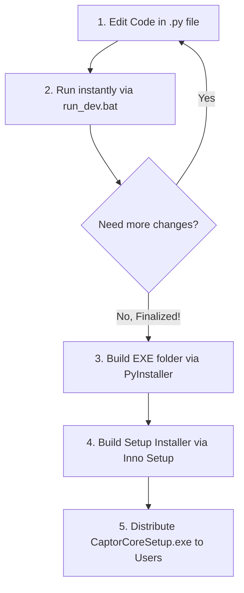

# Developer & Packaging Workflow — Captor Core

This document outlines the standard iteration and packaging workflow for Captor Core. This process ensures fast development feedback (instant launch), zero disk leaks on the C drive, and a professional installation process for the end user.

---

## The Workflow Cycle



---

## 1. Development Phase (Fast Iteration & Coding)

During active development (tweaking UI, fixing bugs, or adding features), **do not compile the executable**. Running a compiler on every minor change is slow and unnecessary.

* **Primary File**: [captioncast_webview.py](file:///d:/downloads/captioncast/captioncast/captioncast_webview.py) (uses HTML/React frontend) or [captioncast.py](file:///d:/downloads/captioncast/captioncast/captioncast.py) (Tkinter fallback)
* **How to run**: Double-click [run_webview.bat](file:///d:/downloads/captioncast/captioncast/run_webview.bat) (React/PyWebView Dashboard) or [run_dev.bat](file:///d:/downloads/captioncast/captioncast/run_dev.bat) (Tkinter) in the project root folder.
* **What it does**:
  - Automatically requests **Administrator privileges** via Windows UAC (necessary to read hardware Ryzen CPU temperatures).
  - Automatically resets the working directory to the project folder (`cd /d "%~dp0"`) to resolve files correctly.
  - Launches the app using the local Python 3.11 environment in under 1 second.
  - **Does not write any temporary files to the C drive.**
  - Pauses the console window on failure so you can read code exceptions/tracebacks easily.

---

## 2. Compilation Phase (One-Folder Packaging)

When development is finalized and we are ready to build a release version, we compile the script into a standalone folder directory containing the launcher executable and all dependencies pre-unpacked.

* **Configuration File**: [captioncast.spec](file:///d:/downloads/captioncast/captioncast/captioncast.spec)
* **How to build**: Open a terminal in the project directory and run:
  ```cmd
  C:\Users\sushi\AppData\Local\Programs\Python\Python311\python.exe -m PyInstaller --noconfirm captioncast.spec
  ```
* **Output Path**: `dist/CaptorCore/`
* **What it does**:
  - Compiles the code and copies all libraries (including heavy CUDA files and `LibreHardwareMonitorLib.dll`) into a single folder `dist/CaptorCore/` in your workspace.
  - Binaries are placed inside the `_internal/` folder to keep the root directory clean.
  - **Does not compress or extract files to the C drive Temp directory at runtime**, preventing space leaks and ensuring the resulting `CaptorCore.exe` opens instantly (in under 1 second).

---

## 3. Installation Packaging Phase (Creating the Setup Installer)

To distribute a single, professional setup file that users can easily install, we compress the `dist/CaptorCore/` folder into a Windows Installer program.

* **Configuration File**: [captioncast.iss](file:///d:/downloads/captioncast/captioncast/captioncast.iss)
* **How to build**:
  - **Option A (Inno Setup GUI)**: Open `captioncast.iss` in Inno Setup and click **Build -> Compile** (or press `Ctrl + F9`).
  - **Option B (Command Line)**: Run the following command in PowerShell/CMD:
    ```cmd
    "C:\Users\sushi\AppData\Local\Programs\Inno Setup 6\ISCC.exe" captioncast.iss
    ```
* **Output Path**: [Output/CaptorCoreSetup.exe](file:///d:/downloads/captioncast/captioncast/Output/CaptorCoreSetup.exe) (File size is ~990 MB).
* **What it does on the user's PC**:
  - Requests Administrator privileges once on run.
  - Installs all files cleanly to `C:\Program Files\Captor Core` (or a custom drive/folder selected by the user via the "Browse..." dialog).
  - Creates Desktop and Start Menu shortcuts pointing to the program.
  - Registers the app in Windows "Add or Remove Programs" for clean, one-click uninstallation.
  - Automatically loads helper DLLs from the installation directory with **zero temp folder clutter**.
